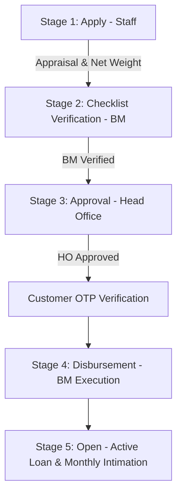
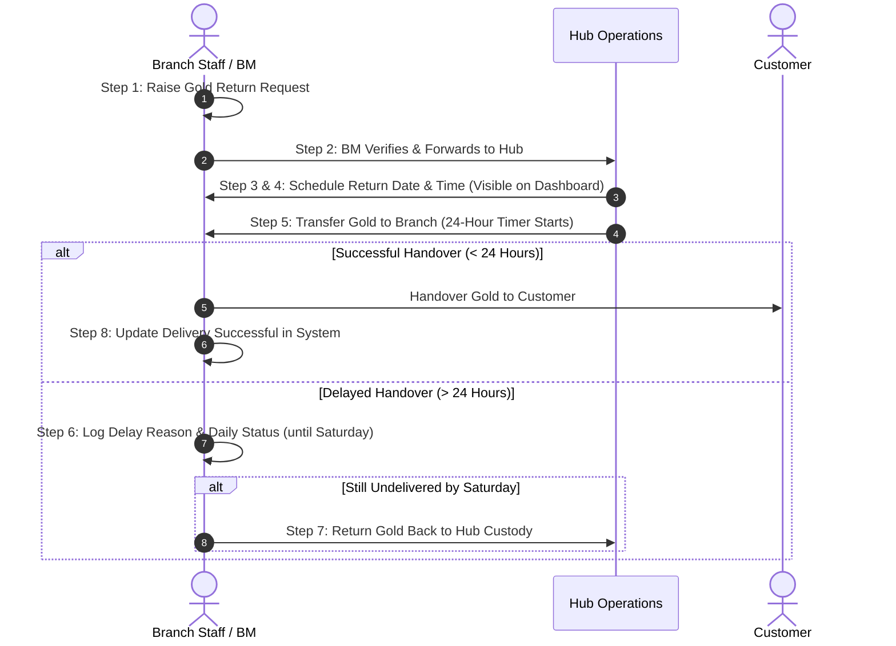

# LKFI GOLD LOAN MODULE - ARCHITECTURE & OPERATIONAL SPECIFICATION

## Overview

The LKFI Gold Loan Module is an enterprise pawn-lending and gold management engine designed for hub-and-spoke multi-branch operations. It incorporates multi-factor authentication (OTP), geo-fenced staff attendance, multi-stage approval workflows, hub-managed gold vaulting, re-pledging workflows, automated reporting, and an integrated support ticketing system.

---

## 1. System Navigation Layout (LKFI Gold Loan Engine)

```text
LKFI GOLD LOAN ERP
│
├── 📊 Dashboard
│   ├── Real-time Vault Balance & Active Loan Metrics
│   ├── Admin Message Popups / Scrolling Announcement Ticker
│   ├── Branch Target Gauges (Business, Collection, Mobile Loan Targets)
│   └── Intimation List Quick View
│
├── 🔐 Security & Attendance
│   ├── Login (Username/Password + Email/SMS OTP Verification)
│   └── Geo-Fenced Attendance (30m Radius Latitude/Longitude Validation)
│
├── ⚙️ Gold Loan Masters
│   ├── Hub Management Master (Hub-to-Branch Mapping & Hub Vaults)
│   ├── Branch Master (Lat/Long Coordinates, Target Settings)
│   ├── Metal / Gold Rate Master (Custom Daily Rate per Gram by Karat/Purity)
│   ├── Branch-wise Scheme Master (₹1,000 Base Engine, Daily Interest % & Day Slabs)
│   ├── Jewel & Item Category Master
│   └── Pledging Bank Master
│
├── 👥 Customer Master
│   ├── Onboarding & KYC Details
│   ├── Signature Upload & Automated Signature Validation
│   └── Monthly Intimation List (Follow-up Status: Open / Closed)
│
├── 🪙 Loan Operations & Stages
│   ├── Stage 1: Apply (Staff - Appraisal, Weight, LTV & Pledging Details)
│   ├── Stage 2: Checklist Verification (Branch Manager Verification)
│   ├── Stage 3: Approval (Head Office Authorization)
│   ├── Stage 4: Disbursement (BM Execution + Customer OTP Verification)
│   ├── Stage 5: Open (Active Loan Management & EMI Collections)
│   └── Loan Disposal / Deletion (Head Office Permission Only)
│
├── 🏦 Gold Custody, Re-Pledging & Return Workflow
│   ├── Bank Gold Pledge Register (Record Bank, Interest, Pledge Date)
│   ├── Gold Re-Pledge & Movement Log (Bank-to-Branch & Branch-to-Hub)
│   └── Gold Return Request Workflow (Branch -> BM -> Hub Schedule -> Delivery Tracker)
│
├── 📈 Automated Reports Engine
│   ├── Waiting Borrowers Report
│   ├── Growth Report
│   ├── Collection Report
│   └── Vault & Packet Audit Register
│
└── 🛠️ Support & System Governance
    ├── Inbuilt Technical Support Ticket System
    ├── Daily Automated Database Backup Scheduler
    └── Admin Message Dispatcher

```

---

## 2. Key Business Engine Configurations

### 2.1 Metal / Gold Rate Master (Rate per Gram)

* Managed directly by authorized staff or Admins in the **Gold Loan Master**.
* Defines the official daily metal rate per gram categorized by purity/karat (e.g., 22K, 24K, 18K).
* All new loan appraisal entries lock in the active daily metal rate at the time of application.

### 2.2 ₹1,000 Base Unit & Daily Interest Engine

Interest is calculated using a **₹1,000 base amount multiplier** with configurable **Daily Interest Rates** mapped across 4 strict day slabs:

$$\text{Base Units} = \frac{\text{Principal Amount}}{1,000}$$

$$\text{Daily Interest Owed} = \text{Base Units} \times \text{Daily Interest Rate (\% or ₹)} \times \text{Days Elapsed}$$

#### Day-Slab Brackets:

1. **Slab 1:** $1 \text{ to } 90 \text{ Days}$
2. **Slab 2:** $91 \text{ to } 180 \text{ Days}$
3. **Slab 3:** $181 \text{ to } 240 \text{ Days}$
4. **Slab 4:** $241 \text{ to } 360 \text{ Days}$

---

## 3. End-to-End Workflows

### 3.1 Five-Stage Loan Lifecycle & Disbursement



1. **Stage 1 (Apply - Staff):** Staff inputs customer details, pledged items, gross/stone/net weights, metal rate, and bank pledging details if applicable.
2. **Stage 2 (Checklist Verification - BM):** Branch Manager verifies physical gold, purity appraisal, and customer signature against the checklist.
3. **Stage 3 (Approval - HO):** Head Office reviews LTV ratios and grants approval.
4. **Stage 4 (Disbursement - BM):** Customer receives an OTP via Email/SMS. Upon entering the valid OTP, the Branch Manager disburses the cash/bank transfer.
5. **Stage 5 (Open):** Loan transitions to active status and registers in the monthly Intimation List for follow-up tracking.

---

### 3.2 Gold Return Workflow (Hub Custody & Handover Engine)



---

### 3.3 Re-Pledging & Hub Vaulting Workflow

* **Hub-and-Spoke Mapping:** Each Hub manages gold custody for one or more assigned branches.
* **Bank Gold Pledging:** Records bank name, pledge date, pledged amount, interest rate, and status when gold is re-pledged to financial institutions.
* **Movement Log:** Full audit tracking when pledged gold is released from a bank and moved back to the Branch or Hub vault.

---

## 4. Administrative & Governance Features

1. **OTP-Enforced Login & Disposal:**
* Multi-Factor Authentication (Email/SMS OTP) required for user logins.
* Customer OTP validation mandatory before final loan disbursement.
* Loan record deletion restricted exclusively to Head Office permissions.


2. **Geo-Fenced Attendance:** Branch Latitude and Longitude coordinates enforce a **30-meter radius limit** for employee attendance clock-in.
3. **Monthly Intimation List:** At the start of every month, active borrowers appear in the Intimation List with status `Open`. Staff must record contact notes to set status to `Closed`.
4. **Admin Announcement System:** Real-time administrative popups or scrolling banner text pushed directly to branch dashboards.
5. **Automated Report Dispatcher:** System scheduler generates and emails **Waiting Borrowers**, **Growth**, and **Collection Reports** daily/weekly.
6. **Inbuilt Support Ticketing:** Staff can log technical issues directly within the ERP and track resolution statuses in real time.