# FINANCIAL ERP SaaS - MASTER ARCHITECTURE & OPERATIONAL SPECIFICATION

## Executive Overview

FINCORP ERP is a multi-tenant, Database-per-Tenant SaaS designed for financial institutions, NBFCs, and private finance firms.

* **Database-per-Tenant:** Every tenant (company) operates on its own completely isolated database.
* **Hierarchical Structure:** Tenant $\rightarrow$ Sub-Companies $\rightarrow$ Branches $\rightarrow$ Employees.
* **Context-Aware Scoping:** Enforces strict Role-Based Access Control (RBAC) across `company_id`, `sub_company_id`, and `branch_id`.

---

## 1. System Architecture

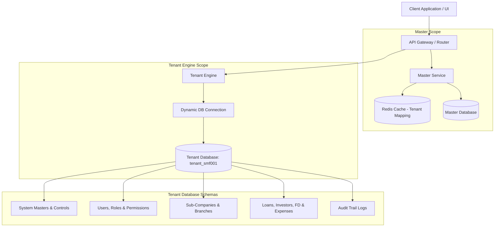

---

## 2. Platform Hierarchy & Super Admin Control

### Super Admin Responsibilities

* Provision Tenant & Generate Unique `Company Code` (e.g., `SMF001`).
* Create & Initialize Isolated Tenant Database (`tenant_smf001`).
* Enable Subscribed Modules (`✓ Finance`, `✗ Gold Loan`, `✗ Chit`, `✗ MFI`).
* Enforce Subscription Caps (e.g., Max Sub-Companies = 3).
* Activate, Suspend, or Upgrade Tenant Subscriptions.

### Tenant Hierarchy Example

```text
Sri Murugan Finance (SMF001)
├── Sub-Company A1
│     ├── Karur Main Branch
│     ├── Karur North Branch
│     └── Salem Branch
├── Sub-Company A2
│     ├── Chennai Branch
│     └── Madurai Branch
└── Sub-Company A3
      ├── Coimbatore Branch
      └── Trichy Branch

```

---

## 3. Multi-Tenant Authentication & Secure Branch Selection

To prevent public enumeration of internal company branch structures, **branch selection occurs strictly AFTER credential verification**.

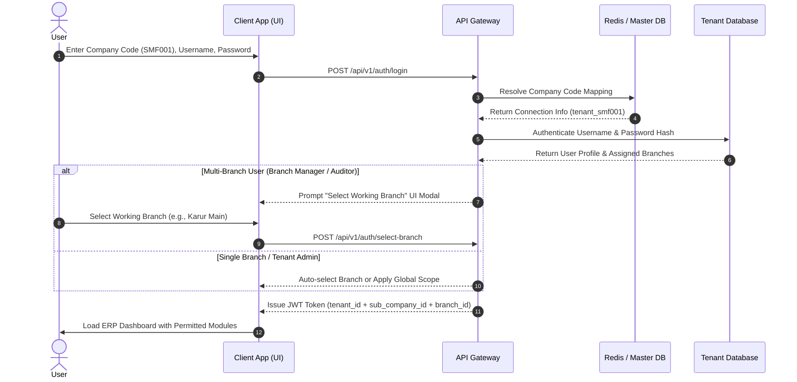

---

## 4. System Master Menu (Central Configurations)

The **Master Menu** is the administrative control center inside each tenant database. It defines rules, schemes, categories, and master parameters that govern how all operational modules behave.

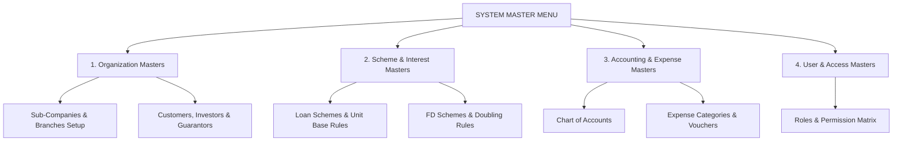

### Key Master Settings Managed:

1. **Scheme Master:** Define Unit Base Defaults (Per ₹100 or Per ₹1,000), default rate brackets, overdue penalty rules, and slab ranges.
2. **Expense Category Master:** Manage approved expense categories (e.g., Office Rent, Salaries, Stationery, Electricity, Agent Commissions, Fuel).
3. **Chart of Accounts Master:** Define root debit and credit ledger heads.
4. **User & Permission Master:** Assign dynamic role permissions (e.g., who can approve loans, who can create expense vouchers, who can void receipts).

---

## 5. Finance Module Workflows

When branch staff enter the Finance Dashboard, five real-time indicators are presented:

1. **Total Disbursed Loans:** Total principal currently active with borrowers.
2. **Total Investor Capital:** Total private capital backing branch operations.
3. **Total FD Liabilities:** Locked customer term deposits and upcoming maturities.
4. **Total Branch Expenses:** Total operating expenses incurred for the active period.
5. **Available Vault Balance:** Net cash available in the branch drawer/bank.

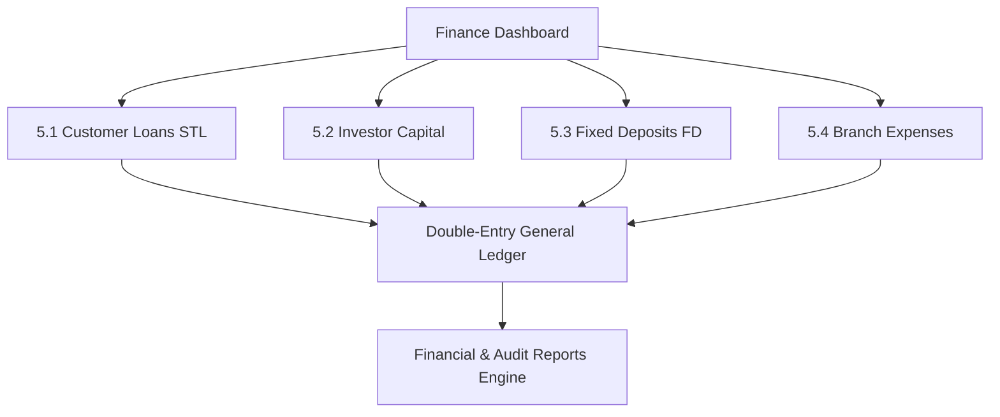

---

### 5.1 Customer Loan Operations (Lending Flow)

Handles Short-Term Loans (STL), daily/weekly/monthly collections, and modular interest calculations.

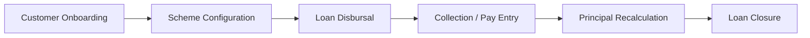

#### Scheme & Interest Engine Rules:

1. **Unit-Based Engine (Per ₹100 / Per ₹1,000 Base):**

$$\text{Base Units} = \frac{\text{Total Loan Amount}}{\text{Unit Base (₹100 or ₹1,000)}}$$


$$\text{Monthly Interest} = \text{Base Units} \times \text{Rate per Unit}$$


2. **Interest Calculation Modes:**
* **Static Rate:** Fixed rate per unit or fixed percentage for the full tenure.
* **Day-Slab Brackets (Tiered Escalation):**
* Days 1 – 90: Rate $A$
* Days 91 – 180: Rate $B$
* Days 181 – 270: Rate $C$
* Days 271+: Rate $D$ (Penalty Rate)


3. **Repayment Modes:**
* **Mode 1 (Interest-Only):** Customer pays accrued interest periodically; principal paid in full at account closure.
* **Mode 2 (Flexible Int + Principal):** Customer pays interest + flexible principal amount. Principal is reduced immediately, and future interest is recalculated **only on the remaining principal balance**.
* **Mode 3 (Fixed Due / EMI):** Combined installment covering Interest portion + Principal reduction.


---

### 5.2 Investor Capital Operations (Private Funding Flow)

Manages external capital injected into the company to fund lending operations.

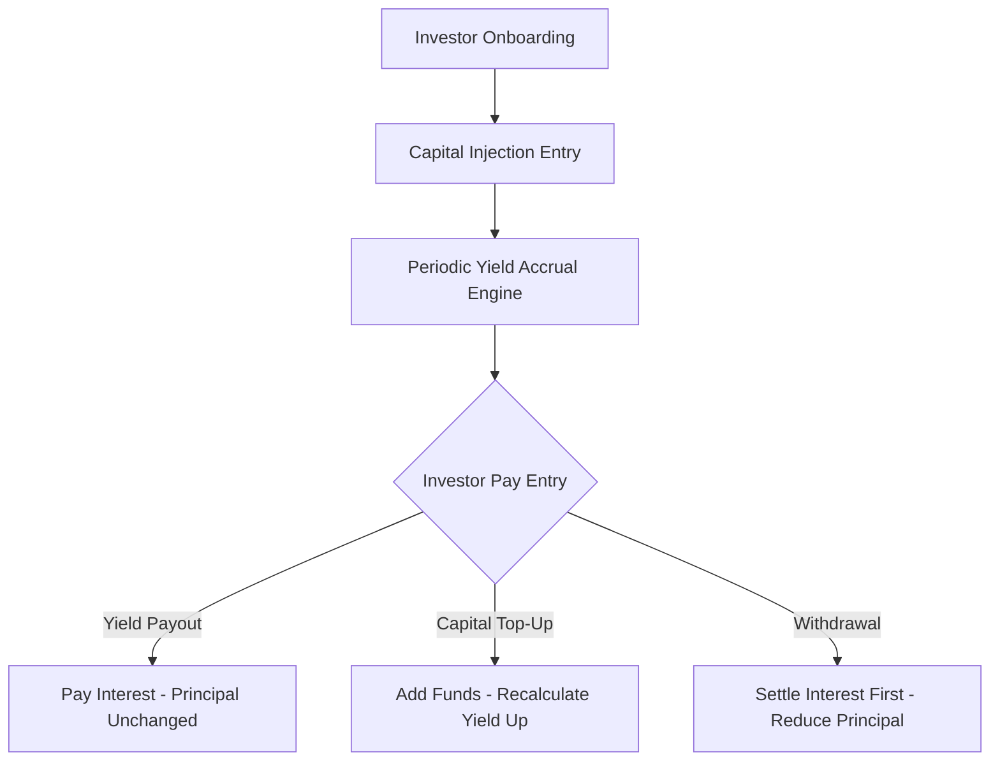

#### Key Rules:

* **Capital Flexibility:** Investors can freely add capital top-ups or request partial principal withdrawals mid-term.
* **Return Schemes:** Static Yield %, Tenure Slabs (1–6 months, 7–12 months, etc.), or Profit Sharing % from branch interest income.
* **Payout Types:** Monthly Yield Payout OR Cumulative Compounded Reinvestment.

---

### 5.3 Fixed Deposit (FD) Operations (Savings Product Flow)

Manages term deposits offered to customers with formal certificate generation and locked tenures.

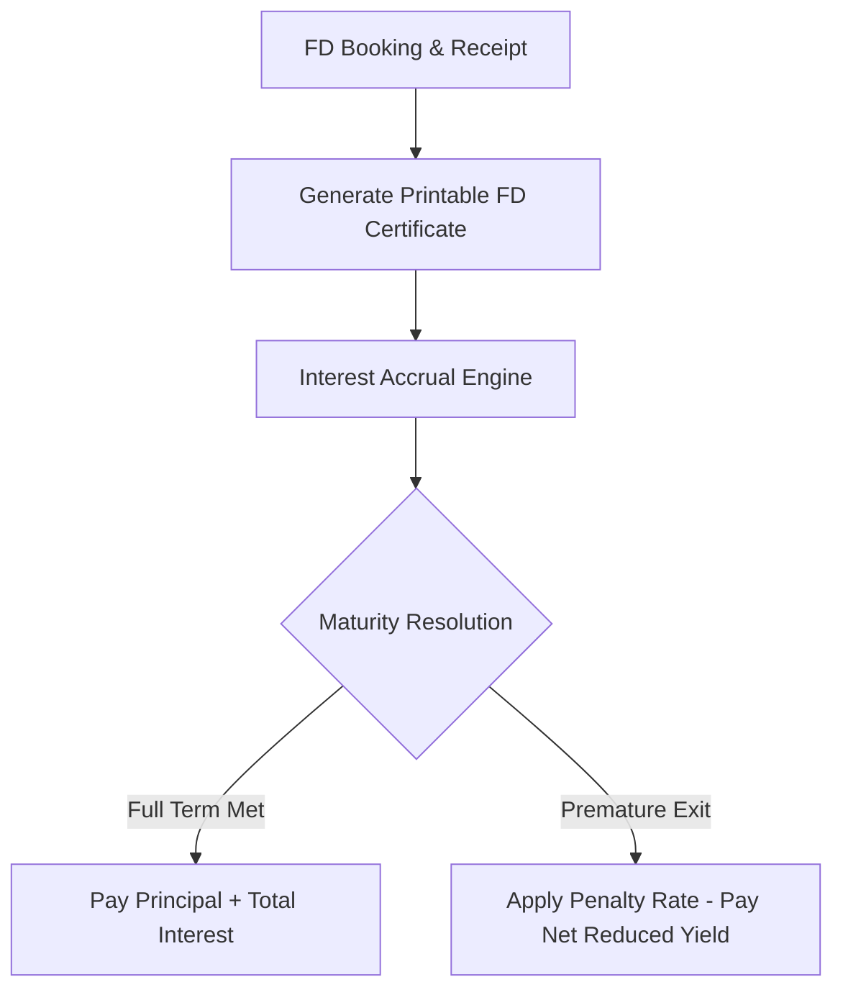

---

### 5.4 Expenses Module (Operational Expenditure Flow)

Manages all day-to-day branch expenditures, petty cash, vendor payments, and administrative overheads.

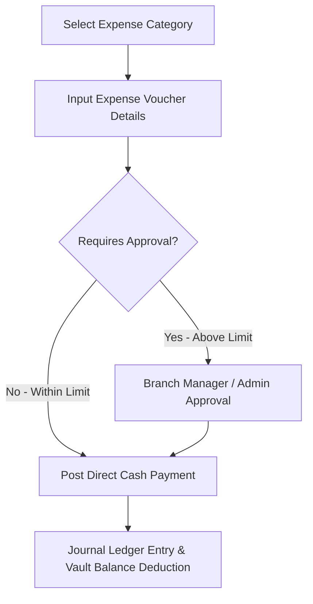

#### Key Features:

* **Expense Categories:** Defined in the **Master Menu** (e.g., Rent, Utilities, Staff Salary, Agent Commission, Legal Fees, Printing/Stationery, Travel/Fuel).
* **Payment Modes:** Cash (Deducts from active Vault Drawer), Bank Transfer, UPI, Cheque.
* **Approval Limits:** Tenant Admin can set approval thresholds in Master Controls (e.g., Expenses $> \text{₹5,000}$ require Branch Manager or Tenant Admin sign-off).
* **Ledger Posting:** Automatically posts a balanced entry:
* `DEBIT : Operating Expense Account (e.g., Rent)`
* `CREDIT: Vault Cash / Bank Account`


---

## 6. Double-Entry Accounting Engine

Every transaction automatically generates balanced Debit and Credit entries in an immutable **General Ledger**.

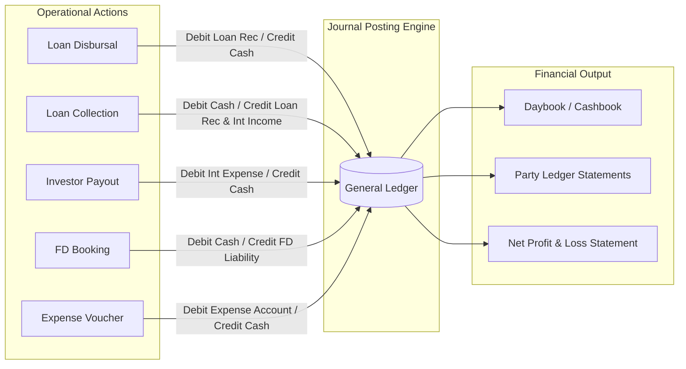

### Core Financial Formula:

$$\text{Net Profit} = \text{Interest Income (Loans)} - \left( \text{Investor Yield} + \text{FD Interest Expense} + \text{Operating Expenses} \right)$$

---

## 7. Audit Logging & System Traceability Engine

Every data modification is logged to prevent fraud and maintain regulatory audit trails. Audit records are **immutable** and cannot be altered or deleted.

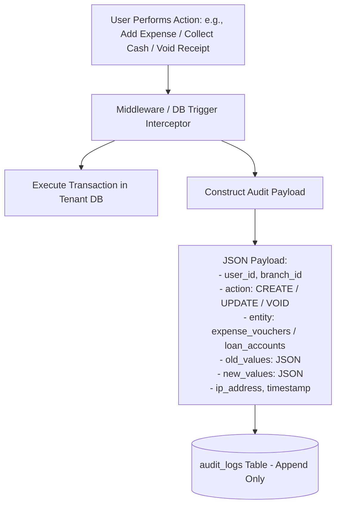

---

## 8. Reports Engine

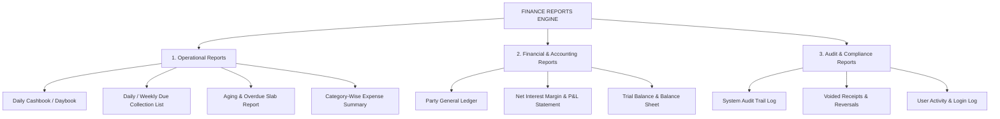

---

## 9. Operational Summary Matrix

| Module | Purpose | Capital Flexibility / Rules | Primary Output |
| --- | --- | --- | --- |
| **System Master** | Central parameters & configuration | Controls schemes, categories & RBAC | System Rules & Dropdown Configs |
| **Customer Loans** | Disbursing funds to borrowers | Flexible principal reduction | Loan Schedule & Collection Receipts |
| **Investor Capital** | Sourcing private business funding | Flexible top-ups & withdrawals | Investor Statement & Yield Vouchers |
| **Fixed Deposits** | Customer term savings scheme | Locked principal during tenure | Printable FD Certificate & Maturity Voucher |
| **Expenses** | Operating overhead management | Category tracking & approval limits | Expense Vouchers & Profit Reduction |

```

```